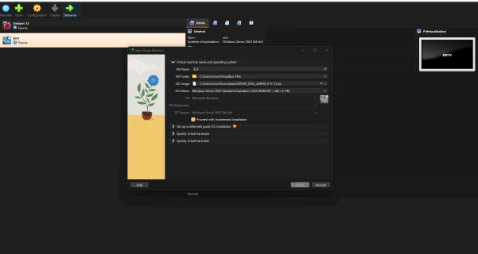
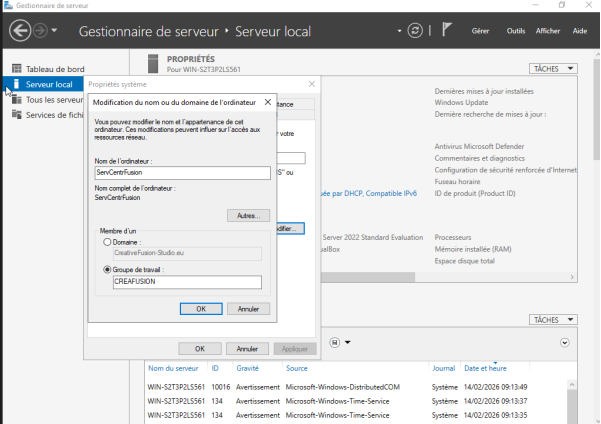
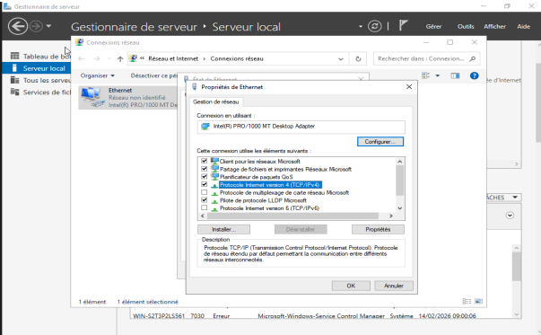
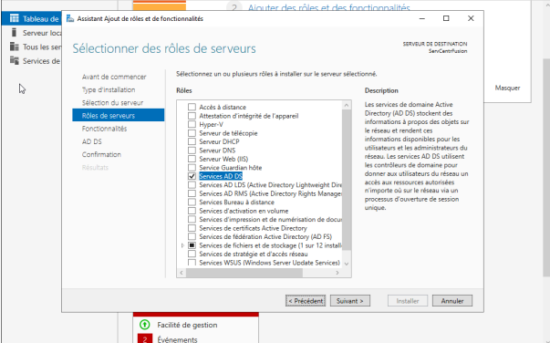
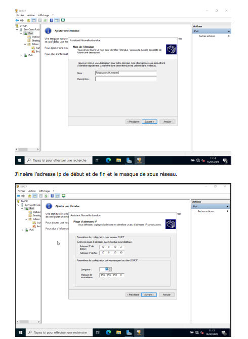
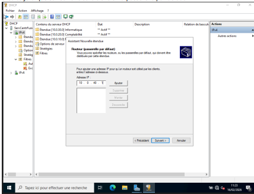

# Active Directory Infrastructure on Windows Server 2022

## Overview

This project demonstrates the deployment and configuration of a complete Active Directory infrastructure using Windows Server 2022.

The objective was to centralize authentication and user management within a corporate environment while implementing DNS and DHCP services.

## Technologies Used

- Windows Server 2022
- Active Directory Domain Services (AD DS)
- DNS
- DHCP
- Oracle VirtualBox

## Features

- Installation of Windows Server 2022
- Static IP configuration
- Domain Controller deployment
- DNS configuration
- DHCP scope creation
- Remote Desktop activation
- Domain integration

## Skills Demonstrated

- Systems Administration
- Network Services Configuration
- Active Directory Management
- Infrastructure Deployment

## Screenshots

Add screenshots showing:

### Windows Server Installation

### Domain Rename

### Static IP Configuration

### Active Directory Installation

### DHCP Configuration

## Project Outcome

Successfully deployed a functional Active Directory environment capable of managing users, devices, DNS, and DHCP services.
